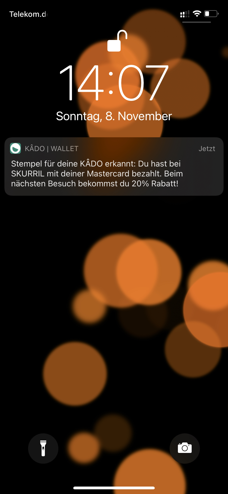

# pyahoi für KÂDO

Dieses Projekt ist das Backend für die Idee KÂDO by Kadoshians.
Die Idee ist im Rahmen des (https://symbioticon.de/ "Symbiotion 2020 Hackathons") entstanden und ist ein modernes Konzept der klassischen Stempelkarte.
Nutzer sammeln Stempel auf KÂDOS (japanisch für Karten), die im Wallet auf den Handys gepsiechert werden.
Dieses Projekt baut auf den APIs von [AHOI](https://www.starfinanz-ahoi.de/de/ "AHOI") und [your pass](https://yourpass.eu "your pass") auf.
Die Stempel können durch Abscannen des QR Codes im Geschäft oder durch Analyse der Zahlungen mit EC-Karte oder Mastercard gesammelt werden.

Der Prozess für das Sammeln aus Nutzersicht umfasst folgende Schritte:
1. Nutzer verknüpft sein Bankkonto mit der pyahoi für KÂDO
2. Das Backend ruft täglich die Transaktionen ab und erkennt, wenn Läden mit KÂDOS besucht wurden
3. Nutzer erhalten eine Notification über ihren gesammelten Stempel wenn die Transaktion erkannt wurde
4. Nutzer freut sich :-)

## KÂDO in dem Wallet

## Verwendung der AHOI Api